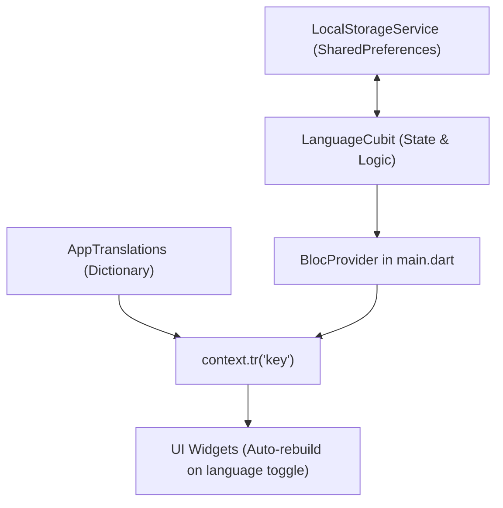

# Localization & Language Management Guide

This document explains how multi-language support (English `en_US` & Bangla `bn_BD`) is structured, persisted, and consumed across the app.

---

## Architecture Overview



The system is composed of four clean components:

1. **Dictionary (`app_translations.dart`)**: Holds key-value mappings for `'en_US'` and `'bn_BD'`.
2. **Storage (`LocalStorageService`)**: Persists user selection in `SharedPreferences` under key `LocalStorageKey.language` (`'en'` or `'bn'`).
3. **State (`LanguageCubit`)**: Holds the active `Locale` (`Locale('en', 'US')` or `Locale('bn', 'BD')`). Emits updates and writes to disk.
4. **Context Extension (`localization_extension.dart`)**: Exposes `context.tr('key')` and `'key'.tr(context)` anywhere in the UI.

---

## 1. Quick Usage in Widgets

Import the extension:

```dart
import 'package:batch_management_app_direct/bloc-version/core/localization/localization_extension.dart';
```

### Basic Text Translation

You can translate text using either syntax:

```dart
// Option A (Recommended)
Text(context.tr('welcome'))

// Option B
Text('welcome'.tr(context))
```

### Checking Current Language

```dart
if (context.isBangla) {
  // Logic specifically for Bangla
}

final currentLocale = context.currentLocale; // Locale('bn', 'BD') or Locale('en', 'US')
```

---

## 2. Using in Modals, Dialogs & Snackbars

Since `tr(...)` is an extension on `BuildContext`, it works everywhere a `BuildContext` is available:

### Dialogs:

```dart
showDialog(
  context: context,
  builder: (dialogContext) => AlertDialog(
    title: Text(dialogContext.tr('logout')),
    content: Text(dialogContext.tr('logout_subtitle')),
  ),
);
```

### Bottom Sheets:

```dart
showModalBottomSheet(
  context: context,
  builder: (sheetContext) => Text(sheetContext.tr('filter_students')),
);
```

### Snackbars:

```dart
AppSnackbar.show(
  context: context,
  message: context.tr('login_successful'),
  isSuccess: true,
);
```

---

## 3. Switching / Toggling Languages

To toggle between English and Bangla anywhere in the app (e.g., in an AppBar or Profile screen):

```dart
// Toggle between English and Bangla:
context.read<LanguageCubit>().toggleLanguage();

// Or set an explicit Locale:
context.read<LanguageCubit>().setLanguage(const Locale('bn', 'BD'));
```

### Example: Switcher Button UI

```dart
BlocBuilder<LanguageCubit, Locale>(
  builder: (context, locale) {
    final isBangla = locale.languageCode == 'bn';
    return GestureDetector(
      onTap: () => context.read<LanguageCubit>().toggleLanguage(),
      child: Text(isBangla ? 'English' : 'বাংলা'),
    );
  },
);
```

---

## 4. Adding New Translation Keys

Open [`app_translations.dart`](./app_translations.dart) and add the key to both `'en_US'` and `'bn_BD'`:

```dart
static const Map<String, Map<String, String>> keys = {
  'en_US': {
    'my_new_title': 'My New Title',
  },
  'bn_BD': {
    'my_new_title': 'আমার নতুন শিরোনাম',
  },
};
```

> **Fallback Safety**: If a key is missing in `'bn_BD'`, the system automatically falls back to `'en_US'`. If it is missing in both, it displays the key string itself instead of crashing.

---

## 5. Storage & Persistence Details

- **Storage Engine**: `SharedPreferences` via `ILocalStorageService`.
- **Key Name**: `LocalStorageKey.language` (`'language'`).
- **Persistence Behavior**:
  - When `toggleLanguage()` or `setLanguage()` is called, the preference is written to `SharedPreferences`.
  - When the app is opened, `LanguageCubit` asynchronously loads the saved value before rendering, restoring the user's previous preference.
